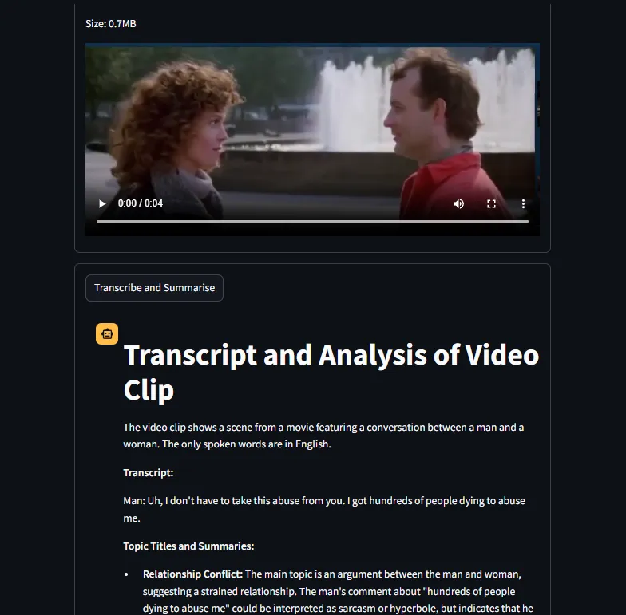
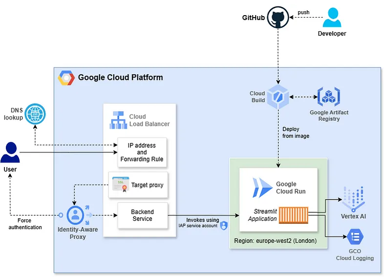

# Youtube and Video



## Repo Overview

This repo describes an end-to-end journey. Briefly:

- We start with an idea. Here, the goal is to work with vidoes, which could be on YouTube. We want to be able to download videos, extract audio, transcribe, translate, and potentially summarise the content.
- We experiment on this idea, using a Jupyter notebook, with Python.
- We try out a few libraries and a couple of classical AI models. 
- Ultimately, we build a solution that makes use of Google Gemini multiomodal GenAI.
- Then we turn the notebook into a web application, using Streamlit.
- Then we package the application as a container.
- And finallly, we host the application on Google Cloud's serverless Cloud Run service.

You can choose to follow / make use of any parts of this journey.

The journey is in three parts. Additionally, each part is supported with a walkthrough, which you can find on [Medium](https://medium.com/python-in-plain-english/downloading-youtube-videos-extracting-audio-and-generating-transcripts-with-python-and-jupyter-c3068f82bbe0).

### Part 1: [youtube-demos.ipynb](src/notebooks/youtube-demos.ipynb)


In this notebook I demonstrate:

- A Jupyter notebook that provides a minimum viable product for a YouTube video downloader application.
- How to quickly setup and use the notebook, including how to run it with zero install effort, in Google Colab.
- Three different ways to download YouTube videos and extract audio to mp3.
- Using the Python Speech Recognition library, along with the Google Speech Recognition API, to transcribe mp3 audio into text.
- Extracting pre-existing transcripts from YouTube videos, and how to translate such transcripts.

See [walkthrough](https://medium.com/python-in-plain-english/downloading-youtube-videos-extracting-audio-and-generating-transcripts-with-python-and-jupyter-c3068f82bbe0).

### Part 2: [youtube-demos-with-google-ai.ipynb](src/notebooks/youtube-demos-with-google-ai.ipynb)

- Using the Google Video Intelligence API to provide more reliable and more accurate trancription.
- Using Google Gemini Generative AI to transcribe, translate and summarise video content.
- How to build your Jupyter notebook so it can run locally, in Google Colab, or in Google Vertex AI Workbench.

See [walkthrough](https://python.plainenglish.io/youtube-video-downloader-with-generative-ai-and-python-run-anywhere-transcribe-and-translate-dec2e593dd58).

### Part 3: [video-intelligence-streamlit](src/video-intelligence-streamlit/)



- Provide a UI in the form of a Streamlit application
- Containerise the application using Docker
- Host the application on Google Cloud Run

See [walkthrough](https://medium.com/google-cloud/running-ai-youtube-and-video-processing-as-a-python-streamlit-web-application-and-hosting-on-748aae8e54b4).

## Overview of Jupyter Notebooks

If you don't know much about Jupyter notebooks, then I suggest you start with my article [here](https://medium.com/python-in-plain-english/five-ways-to-run-jupyter-labs-and-notebooks-23209f71e5c0), which covers:

- The value and point of Jupyter notebooks.
- Good use cases for Jupyter notebooks.
- Several ways to run the notebooks
- How to run your own - or someone else's notebooks (like the ones in this repo) - quickly and easily, _for free_ in [Google Colab](https://colab.research.google.com/).

### Running the Jupyter Notebook Locally

Here we create a Python virtual environment, install Jupyter notebook to the environment, and then run our notebooks from there.

```bash
py -m pip install --upgrade pip

# Create virtual env, if you haven't already
py -m venv .venv

# Activate the venv
./.venv/Scripts/activate

# Install requirements - i.e. notebook
py -m pip install -r requirements.txt
```

Now you can use your venv as your Jupyter kernel.

