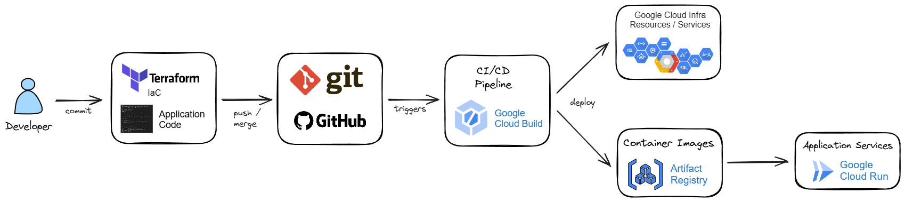

# Deployment

## Overview

Our CI/CD pipeline looks like this:


<br><br>

- Application code is stored in our GitHub repo. 
- We store infrastructure-as-code as Terraform configuration, in the same repo.
- We use Cloud Build to implement CI/CD, such that changes pushed to GitHub result in automatic deploys of our infrastructure and application services.
- We need two target Google Cloud projects: `Dev` and `Prod`.
- We have two corresponding branches in git: `dev` and `main`.
- Cloud Build configuration is achieved using a `cloudbuild.yaml` file, also stored in GitHub.
- We create a trigger in the `Dev` project and another trigger in the `Prod` project. Both triggers will point to the `cloudbuild.yaml` but each will trigger with pushes to the respective branch. Thus, a given trigger results in deployment only to the required project.
The main branch should be protected and will only trigger a build when a merge from dev into main is approved.
- Each project has its own service account for Cloud Build. This is a good security best practice, as the default service account has too much power.
- Changes to the Terraform IaC will result in Terraform applying the changes to the infrastrucutre.
- Changes to the application code will result in building a new container image - stored in Google Cloud Artifact Registry - and then deploying a new Cloud Run service.

### Terraform

- Terraform configuration is stored in `deploy/tf`.
- Override environment variables in `vars/dev.tfvars` and `vars/prod.tfvars`. E.g. \
`terraform plan -var-file=vars/dev.tfvars`

### Cloud Run Application

 - The Cloud Run service is deployed/updated using Cloud Build, which is triggered by a push to the repo.
 - Cloud Build runs the build, based on the YAML, i.e. `deploy/cloudbuild.yaml`.
 - The YAML deploys the service using gcloud commands. (Terraform is not a sensible choice for deploying Cloud Run service revisions.)

## Steps

- Create your Dev and Prod projects. Ensure you have required roles, or `Editor` role.
- Fork and clone this repo. The CI/CD will establish a connection between Cloud Build in your projects, and the GitHub repo. This will need you to own your own copy of this repo.
- Proceed with the following steps using the `Dev` project.
- Create a `.env` file from your dev environment. E.g.

```bash
export PYTHONPATH="src:src/notebooks"
export PROJECT_ID="video-smarts-dev"
export REGION="europe-west4"
export MY_ORG="someorg.com"
export DOMAIN_NAME="video-intelligence.someorg.com"
```

Now do the initial configuration for your development environment:

```bash
# Load env variables from your .env file. First we'll do the dev environment
source .env.dev

# Authenticate yourself to gcloud
# And also setup ADC so any locally running application can access Google APIs
# Note that credentials will be saved to 
# ~/.config/gcloud/application_default_credentials.json
gcloud auth login --update-adc 

export PROJECT_NUMBER=$(gcloud projects describe $PROJECT_ID --format="value(projectNumber)")

# Check we're in the correct project
gcloud config list project

# If we're on the wrong project...
gcloud config set project $PROJECT_ID
gcloud auth application-default set-quota-project $PROJECT_ID
gcloud config list project

# Enable APIs required for us to run apply Terraform and run Cloud Build
gcloud services enable \
  serviceusage.googleapis.com \
  cloudresourcemanager.googleapis.com \
  cloudbuild.googleapis.com \
  secretmanager.googleapis.com
```

If you haven't already, [install the Cloud Build GitHub Connector app](https://cloud.google.com/build/docs/automating-builds/github/connect-repo-github?generation=2nd-gen#console). Obtain the GitHub App Installation ID from the URL, when you [view/edit the configuration for the connector app](https://github.com/apps/google-cloud-build). Add it to your `terraform.tfvars` file.


Now you'll need to [create a GitHub personal access token (PAT)](https://docs.github.com/en/authentication/keeping-your-account-and-data-secure/managing-your-personal-access-tokens) to allow Cloud Build from our projects to connect to GitHub. We do this by creating a PAT in GitHub, and then storing this PAT in Google Secret Manager. Copy the PAT, and use it to create a Google Cloud secret in Secret Manager:

```bash
echo -n <paste_your_token> | gcloud secrets create github-pat --data-file=-
```

Now we're ready to run the Terraform:

```bash
cd deploy/tf
terraform init
terraform validate

# Create a plan using dev variables, and save the plan
terraform plan -var-file vars/dev.tfvars -out dev_plan.tfplan

# Apply
terraform apply dev_plan.tfplan
```

That's it!

Now repeat for the `Prod` project.